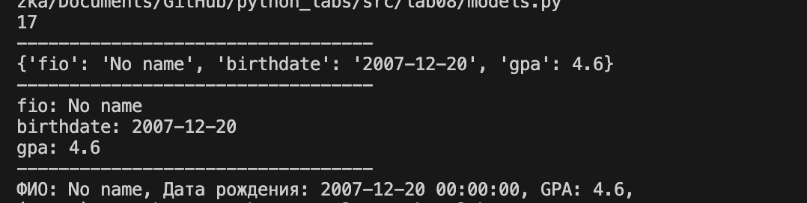
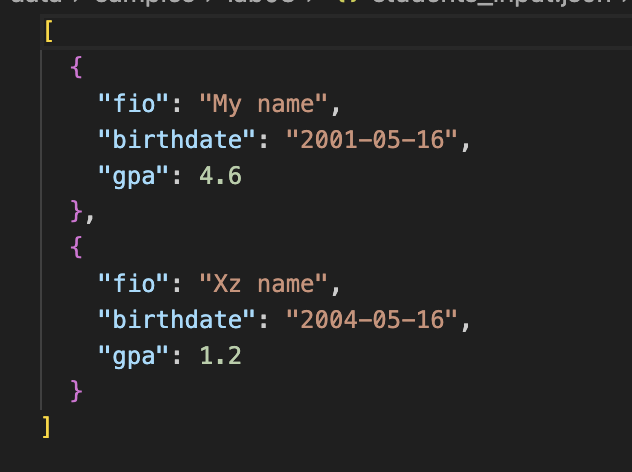

<h1>Прграммирование и алгоритмизация (Лабораторные)</h1>

<h2>Лабораторная №8:</h2>

**Задание №1:**
```python
ifrom dataclasses import dataclass
from datetime import datetime, date

@dataclass
class Student:
    fio: str
    birthdate: str
    group: str
    gpa: float

    def __post_init__(self):
        # TODO: добавить нормальную валидацию формата даты и диапазона gpa
        self.birthdate = self.birthdate.replace("-", "/")
        try:
            self.birthdate = datetime.strptime(self.birthdate, "%Y/%m/%d")
        except ValueError:
            raise ValueError("warning: birthdate format might be invalid")

        if not (0 <= self.gpa <= 10):
            raise ValueError("gpa must be between 0 and 10")

    def age(self) -> int:
        # TODO: добавить нормальную валидацию формата даты и диапазона gpa
        b = self.birthdate
        today = date.today()
        if today.month < b.month or (today.month == b.month and today.day < b.day):
            return today.year - int(b.year) - 1
        else:
            return today.year - int(b.year)

    def to_dict(self) -> dict:
        # TODO: проверить полноценность полей
        if not self.fio or not self.fio.strip():
            raise ValueError("FIO cannot be empty")

        return {
            "fio": self.fio,
            "birthdate": self.birthdate.strftime("%Y-%m-%d"),
            "gpa": self.gpa,
        }

    @classmethod
    def from_dict(cls, d: dict):
        for key, value in zip(d.keys(), list(d.values())):
            print(f"{key}: {value}")

    def __str__(self):
        # TODO: f"{}, {}, {}"
        return f"ФИО: {self.fio}, Дата рождения: {self.birthdate}, GPA: {self.gpa}, "

st1 = Student("No name", "2007-12-20", "SE-01", 4.6)
print(f"{st1.age()}\n----------------------------------")
print(f"{st1.to_dict()}\n----------------------------------")
st1.from_dict(st1.to_dict())
print("----------------------------------")
print(f"{st1.__str__()}")

```



--------------------------------------------------------------------
**Задание №2:**
```python
import json
from pathlib import Path
import models
from datetime import datetime, date

# st_object = models.Student("My name", "2001-05-16", "BIVT-25-3", 4.6)
students = [models.Student("My name", "2001-05-16", "BIVT-25-3", 4.6), models.Student("Xz name", "2004-05-16", "BIVT-66-6", 1.2)]

def students_to_json(students: list, path):
    data = [s.to_dict() for s in students]
    try:
        with open(path, 'w', encoding='utf-8') as f:
            json.dump(data, f, ensure_ascii=False, indent=2)
    except:
        raise FileNotFoundError("File not found")

def students_from_json(path):
    try:
        with open(path, 'r', encoding='utf-8') as f:
            data = json.load(f)
    except:
        raise FileNotFoundError("File not found")
    data_gpa = [i.get('gpa') for i in data]
    data_birth = [i.get('birthdate').replace("-", "/") for i in data]
    try:
        data_birth = [datetime.strptime(data_date, "%Y/%m/%d") for data_date in data_birth]
    except:
        raise ValueError("warning: birthdate format might be invalid")

    if not (0 <= all(data_gpa) <= 10):
        raise ValueError("warning: gpas must be between 1 and 10")

    for key, val in zip(data, data_birth):
        key["birthdate"] = val.strftime("%Y-%m-%d")

    with open("/Users/zamazka/Documents/GitHub/python_labs/src/data/samples/lab08/students_output.json", 'w', encoding='utf-8') as f:
        json.dump(data, f, ensure_ascii=False, indent=2)


students_to_json(students, Path("/Users/zamazka/Documents/GitHub/python_labs/src/data/samples/lab08/students_input.json"))
print(students_from_json("/Users/zamazka/Documents/GitHub/python_labs/src/data/samples/lab08/students_input.json"))
```


-------------------------------------------
