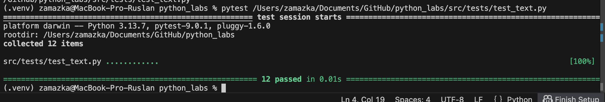
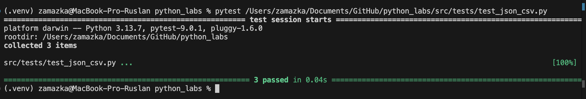
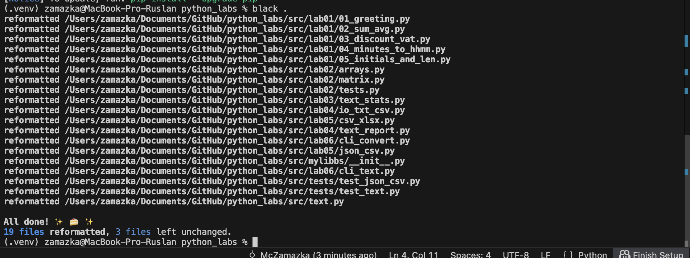

<h1>Прграммирование и алгоритмизация (Лабораторные)</h1>

<h2>Лабораторная №7:</h2>

**Задание №1:**
```python
import pytest
from text import *


@pytest.mark.parametrize(
    "source, expected",
    [
        ("ПрИвЕт\nМИр\t", "привет мир"),
        ("ёжик, Ёлка", "ежик, елка"),
        ("Hello\r\nWorld", "hello world"),
        ("  двойные   пробелы  ", "двойные пробелы"),
    ],
)
def test_normalize_basic(source, expected):
    assert normalize(source) == expected


@pytest.mark.parametrize(
    "source, expected",
    [
        ("привет мир", ["привет", "мир"]),
        ("hello,world!!!", ["hello", "world"]),
        ("по-настоящему круто", ["по-настоящему", "круто"]),
        ("2025 год", ["2025", "год"]),
        ("emoji 😀 не слово", ["emoji", "не", "слово"]),
    ],
)
def test_tokenize_basic(source, expected):
    assert tokenize(source) == expected


@pytest.mark.parametrize(
    "source, expected",
    [
        (["a", "b", "a", "c", "b", "a"], {"a": 3, "b": 2, "c": 1}),
        (["bb", "aa", "bb", "aa", "cc"], {"aa": 2, "bb": 2, "cc": 1}),
    ],
)
def test_count_freq_and_top_n(source, expected):
    assert count_freq(source) == expected


@pytest.mark.parametrize(
    "source, n, expected",
    [
        ({"a": 3, "b": 2, "c": 1}, 2, [("a", 3), ("b", 2)]),
    ],
)
def test_top_n_tie_breaker(source, n, expected):
    assert top_n(source, n) == expected

```



--------------------------------------------------------------------
**Задание №2:**
```python
import pytest
import csv, json
from pathlib import Path
from src.lab05.json_csv import json_to_csv, csv_to_json


def test_json_to_csv_roundtrip(tmp_path: Path):
    src = tmp_path / "people.json"
    dst = tmp_path / "people.csv"
    data = [
        {"name": "Alice", "age": 22},
        {"name": "Bob", "age": 25},
    ]
    src.write_text(json.dumps(data, ensure_ascii=False, indent=2), encoding="utf-8")
    json_to_csv(str(src), str(dst))
    with dst.open(encoding="utf-8") as f:
        rows = list(csv.DictReader(f))
    assert len(rows) == 2
    assert {"name", "age"} <= set(rows[0].keys())


def test_csv_to_json_roundtrip(tmp_path: Path):
    src = tmp_path / "people.csv"
    dst = tmp_path / "people.json"
    data = [{"name": "Alice", "age": 22}, {"name": "Bob", "age": 25}]
    with open(src, "w", newline="", encoding="utf-8") as f:
        fieldnames = list(data[0].keys())
        writer = csv.DictWriter(f, fieldnames=fieldnames)
        writer.writeheader()
        writer.writerows(data)
    csv_to_json(str(src), str(dst))
    with dst.open(encoding="utf-8") as f:
        rows = json.load(f)
    assert len(rows) == 2


@pytest.mark.parametrize(
    "function, input_file, error",
    [
        (json_to_csv, "people.json", ValueError),
    ],
)
def test_json_to_csv(function, input_file, error, tmp_path: Path):
    file_path = tmp_path / input_file
    file_path.write_text("Error???", encoding="utf-8")
    dst = tmp_path / "people.csv"
    f = json_to_csv if function is json_to_csv else csv_to_json
    with pytest.raises(error):
        f(str(file_path), str(dst))

```



-------------------------------------------